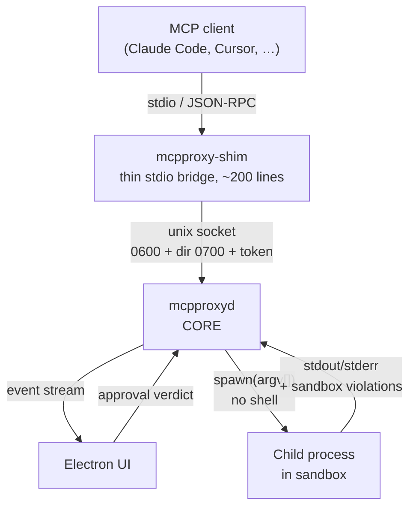
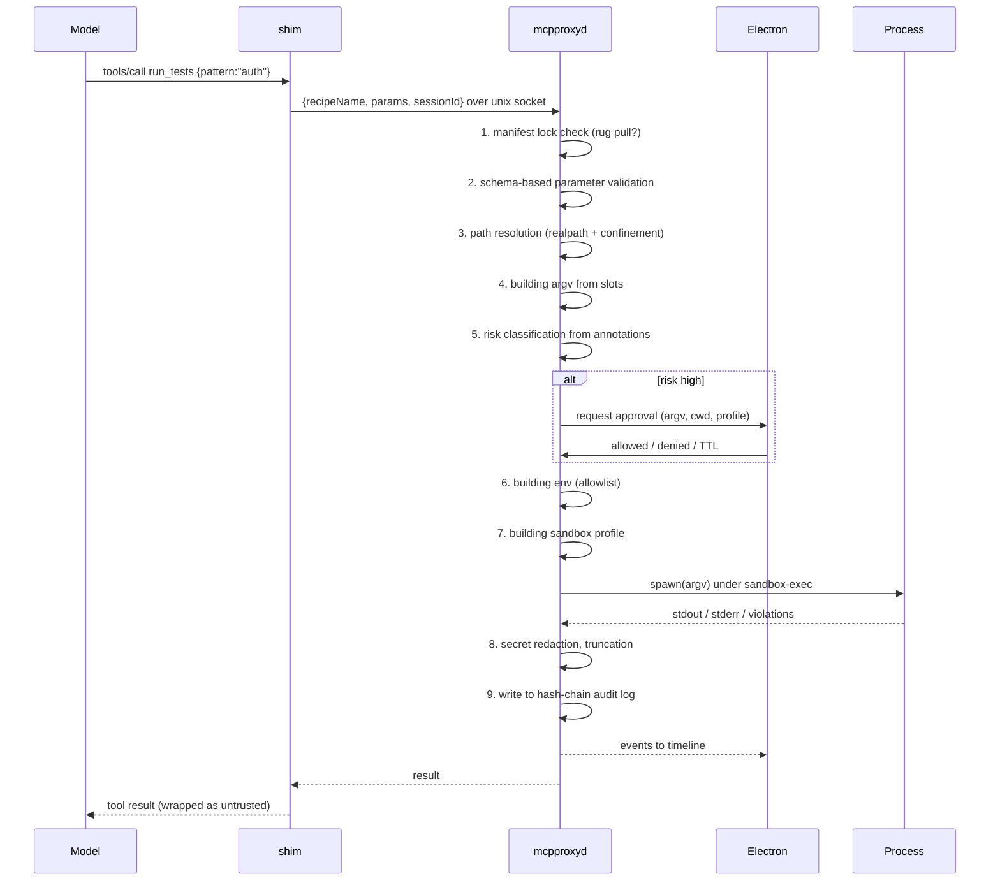

# 02 — Architecture

## Topology

Electron **is not** the host of the MCP server. The client (Claude Code) spawns the MCP server
as a subprocess over stdio; spawning Electron for every session would be unacceptable
(multiple windows, heavy startup, no unified audit trail). Hence three components:



### Why it's built this way

| Component | Responsibility | Why separate |
|---|---|---|
| `mcpproxy-shim` | Forward JSON-RPC from the client to the daemon and back | The client requires a stdio subprocess; it must be cheap and disposable |
| `mcpproxyd` | Policy, validation, sandbox, audit, approvals | A single source of truth across all sessions; survives client restarts |
| `packages/core` | All daemon logic as a library **with zero Electron imports** | Testability, reuse, CI without a display |
| Electron UI | Observation and authoritative confirmations | Confirmations must happen outside the model's context |

The daemon embeds `core`. If the app isn't running, the shim starts it.
The alternative — fail-closed ("no UI → no audit → no execution") — is architecturally
cleaner and makes a strong demo thesis, but is annoying in everyday use.
Solution: auto-start, with a `--require-ui` flag for strict mode.

## Invariants

These are fixed in code and tests and are not up for debate within individual features.

### И1. No shell. Ever.

Only `spawn(argv[])`. Never `shell: true`, never `exec`, never string concatenation of
a command. Injection is killed not by checks but by construction: if a command string
doesn't exist, there's nothing to inject into.

### И2. Parameters aren't concatenated, they occupy slots

Each parameter in the manifest declares which argv positions it expands into.
The value lands there as a separate array element.

```yaml
params:
  pattern:
    type: string
    pattern: "^[\\w./-]{0,64}$"
    argv: ["--testPathPattern", "{}"]   # two separate argv elements
```

### И3. Paths — only via realpath + root confinement

The check is performed **after** symlinks are resolved. A check that "the string doesn't contain `..`"
can be bypassed with a symlink in ten seconds and is not a real defense.

### И4. Secrets never enter the process

Env allowlist on input: the child process receives only explicitly listed variables
plus a minimal `PATH`. Everything else is stripped. This is the **real** protection.
Output redaction is a safety net, not the primary mechanism.

### И5. The daemon accepts no commands, only recipe names

Over IPC it receives `{recipeName: "run_tests", params: {...}, sessionId: "…"}`. Never argv,
never a path to a binary. This is a direct consequence of the attack described in the MCP spec (see И6). The shape is frozen
as `IpcRequest` in `packages/contracts`: the field is called `recipeName` because the word
`recipe` in the contract refers to the recipe object, not its name.

### И6. The IPC socket is a security boundary

The MCP specification describes an attack — [«stdio Transport Security in Proxy Scenarios»](https://modelcontextprotocol.io/specification/draft/basic/security_best_practices) —
that describes our architecture almost literally: a proxy that spawns processes, plus a stolen
proxy authentication token = RCE. Countermeasures:

- a unix domain socket with `0600` permissions in the user's directory, not a TCP port;
- ~~peer credential verification on connect (`LOCAL_PEERCRED` on macOS)~~ — **not reachable
  from plain Node**, probe П11; the property it would deliver ("only this user's processes may
  connect") is instead held by the `0700` directory permissions, which the OS enforces during
  path resolution. Discussed in `10-honest-limitations.md`;
- a per-session token, never stored in config, never passed in the shim's argv;
- and, most importantly — И5: even full control of the socket only allows invoking existing recipes
  with validated parameters, not arbitrary execution.

### И7. Script output is untrusted data

Output flows into the model's context and is a channel for indirect prompt injection (OWASP ASI01).
It is wrapped with an explicit untrusted marker, scanned for injection patterns and secrets,
and truncated by size.

### И8. Electron IPC is also a security boundary

`contextIsolation: true`, `sandbox: true`, `nodeIntegration: false`, a strict CSP.
Every message from the renderer is validated as an untrusted HTTP request.
For a security tool to fail here would mean failing everything.

## Call path



Each stage the call passes through is a separate event in the UI timeline. This step-by-step
granularity is exactly what makes the demo legible: you can see at which step the call stopped.

The frozen `stageOrder` has **thirteen** stages, not nine: the diagram above collapses
`build_env`, `build_profile` and `violation` into neighbouring steps. A successful call
produces twelve events — the contract marks `violation` as "may occur many times", and zero is
a legal count. A stage the call never reached has no event at all.

## Sandbox permission model

Asymmetric, borrowed from `@anthropic-ai/sandbox-runtime` (see [ADR-0002](adr/0002-sandbox-runtime.md)):

| Operation | Default | Priority |
|---|---|---|
| Read | allowed | `allowRead` beats `denyRead` — carve out readable islands within denied zones |
| Write | denied | `denyWrite` beats `allowWrite` — carve out protected islands within allowed zones |
| Network | denied | domain allowlist via an HTTP/SOCKS5 proxy on the host |

**Mandatory deny paths** — a write block that cannot be lifted even by an explicit `allowWrite`:
`.bashrc`, `.zshrc`, `.profile`, `.gitconfig`, `.git/hooks/`, `.vscode/`, `.idea/`,
`.claude/commands/`. These are persistence vectors: writing there enables code execution later,
already outside the sandbox.

## Sandbox tiers

| Implementation | Status | Purpose |
|---|---|---|
| `none` | implementing | **Baseline for the demo.** Without a contrast, a "100% blocked" number means nothing. This mode is **observing, not blind**: the same HTTP/SOCKS5 proxy from `srt` is handed to the child via proxy env vars, so exfiltration is visible and counted in bytes — it's just not blocked |
| `seatbelt` | primary | `sandbox-exec` + network proxy filtering via `srt` |
| `container` | stub | Interface exists, implementation is out of scope for this slice |

Docker is deliberately not used: it requires the demo viewer to have Docker, adds 300–800 ms
per call (hurting the overhead metric), and provides little extra isolation for our scenario.

## Audit

Append-only JSONL, hash-chain: each entry includes the hash of the previous one.

The formula is frozen in `packages/contracts` (`chainHash`), and it is not field-by-field:

```
self = sha256(utf8(canonicalizeJcs({ prev, event })))
```

**The entire event** is hashed together with the reference to the previous entry. Enumerating
fields would be a hole: any field added to the event after freezing would silently drop
out of the hash and become forgeable, and no test would catch it. The canonical form is
RFC 8785 (JCS). The digest is 64 lowercase hex characters **without a `sha256:` prefix**; the prefix
that appears in the examples below is a display convention, not part of the string.

Not only the digest is verified, but also the **linkage**: `verifyChain` requires that `prev` of each
entry match `self` of the previous one. Without this condition, checking "each entry is
internally consistent" has zero evidentiary value — the formula is public, and an attacker
editing an entry can just recompute its `self`.

Modifying any past entry breaks all subsequent hashes. The UI shows a
"chain verified" badge, recomputed on the fly. Periodic publication of a Merkle root is a
cheap extension that provides Certificate-Transparency-style verifiable consistency.

**What the chain doesn't catch:** truncating the tail of the log. By deleting the last entries entirely, an attacker
leaves the chain consistent. This requires an external anchor — the same Merkle root or
an external timestamp; in E0 there is none, and this must not be represented otherwise.

## Repository layout

```
packages/
  contracts/     # E0: manifest JSON Schema, event schema, TS types. Frozen.
  core/          # E1-E3, E6: policy, validation, executor, audit. No Electron.
  mcp-server/    # E4: MCP surface + shim
  desktop/       # E7: Electron
  bench/         # E8: red-team corpus and metrics
docs/            # this documentation
.claude/skills/  # mcpproxy-deck — slide-deck generator
```
