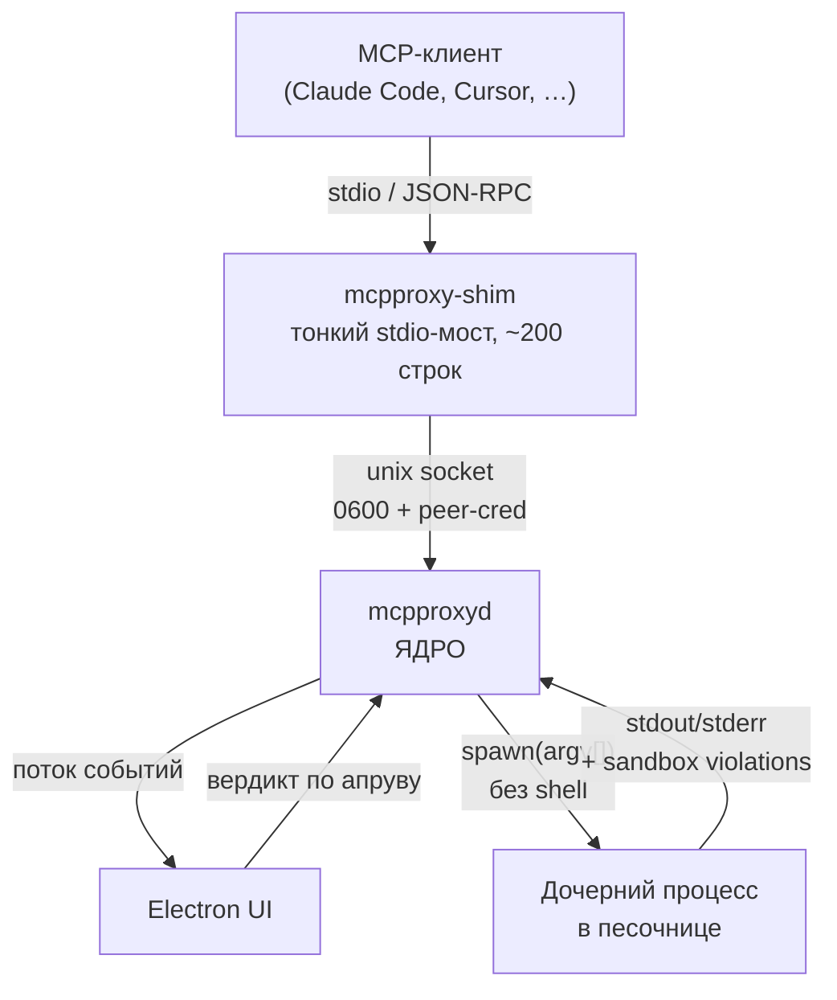
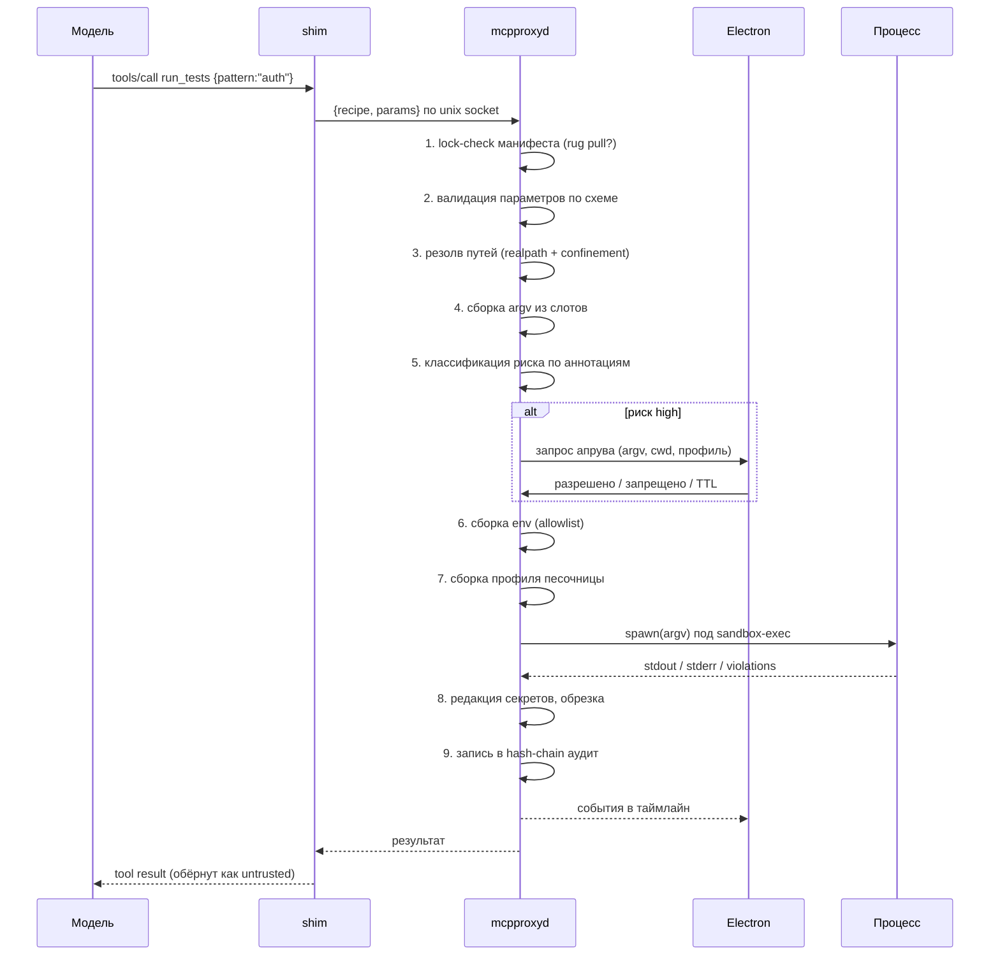

# 02 — Архитектура

## Топология

Electron **не является** хостом MCP-сервера. Клиент (Claude Code) спавнит MCP-сервер
как subprocess по stdio; спавнить Electron на каждую сессию — неприемлемо
(множественные окна, тяжёлый старт, нет единого аудита). Поэтому три части:



### Почему именно так

| Компонент | Ответственность | Почему отдельно |
|---|---|---|
| `mcpproxy-shim` | Пробросить JSON-RPC от клиента к демону и обратно | Клиент требует stdio-subprocess; должен быть дешёвым и одноразовым |
| `mcpproxyd` | Политика, валидация, песочница, аудит, апрувы | Одна точка истины на все сессии; переживает перезапуск клиента |
| `packages/core` | Вся логика демона как библиотека **без единого импорта Electron** | Тестируемость, переиспользование, CI без дисплея |
| Electron UI | Наблюдение и authoritative-подтверждения | Подтверждения обязаны быть вне контекста модели |

Демон встраивает `core`. Если приложение не запущено — shim его поднимает.
Альтернатива fail-closed («нет UI → нет аудита → нет исполнения») архитектурно
красивее и является сильным тезисом для демо, но в повседневности раздражает.
Решение: авто-запуск, с флагом `--require-ui` для строгого режима.

## Инварианты

Это то, что фиксируется в коде и в тестах и не подлежит обсуждению в рамках фич.

### И1. Нет shell. Никогда.

Только `spawn(argv[])`. Никогда `shell: true`, никогда `exec`, никогда конкатенация
строки команды. Инъекция убивается не проверками, а конструкцией: если строки команды
не существует, в неё нечего инжектить.

### И2. Параметры не склеиваются, а занимают слоты

Каждый параметр в манифесте объявляет, в какие позиции argv он раскрывается.
Значение попадает туда как отдельный элемент массива.

```yaml
params:
  pattern:
    type: string
    pattern: "^[\\w./-]{0,64}$"
    argv: ["--testPathPattern", "{}"]   # два отдельных элемента argv
```

### И3. Пути — только через realpath + root confinement

Проверка выполняется **после** разрешения симлинков. Проверка «строка не содержит `..`»
обходится симлинком за десять секунд и не является защитой.

### И4. Секреты не попадают в процесс

Env-allowlist на входе: дочерний процесс получает только явно перечисленные переменные
плюс минимальный `PATH`. Всё остальное вырезается. Это **настоящая** защита.
Редакция вывода — страховочная сетка, а не основной механизм.

### И5. Демон не принимает команды, только имена рецептов

По IPC приходит `{recipeName: "run_tests", params: {...}, sessionId: "…"}`. Никогда — argv,
никогда — путь к бинарю. Это прямое следствие атаки из спеки MCP (см. И6). Форма заморожена
как `IpcRequest` в `packages/contracts`: поле называется `recipeName`, потому что слово
`recipe` в контракте означает объект рецепта, а не его имя.

### И6. IPC-сокет — граница безопасности

Спецификация MCP описывает атаку [«stdio Transport Security in Proxy Scenarios»](https://modelcontextprotocol.io/specification/draft/basic/security_best_practices)
буквально про нашу архитектуру: прокси, который спавнит процессы, плюс украденный токен
аутентификации прокси = RCE. Меры:

- unix domain socket с правами `0600` в каталоге пользователя, не TCP-порт;
- проверка peer credentials на соединении (`LOCAL_PEERCRED` на macOS) — uid должен совпадать;
- per-session токен, не хранится в конфиге, не попадает в argv shim'а;
- и главное — И5: даже полный контроль над сокетом даёт только вызов существующих рецептов
  с валидируемыми параметрами, а не произвольное исполнение.

### И7. Вывод скрипта — недоверенные данные

Вывод попадает в контекст модели и является каналом indirect prompt injection (OWASP ASI01).
Оборачивается явным маркером недоверенности, сканируется на injection-паттерны и секреты,
обрезается по размеру.

### И8. Electron IPC — тоже граница безопасности

`contextIsolation: true`, `sandbox: true`, `nodeIntegration: false`, жёсткий CSP.
Каждое сообщение из renderer валидируется как недоверенный HTTP-запрос.
Инструменту безопасности провалиться здесь — значит провалить всё.

## Путь вызова



Каждый из девяти шагов — отдельное событие в таймлайне UI. Именно эта пошаговость
делает демо наглядным: видно, на каком шаге вызов остановился.

## Модель прав песочницы

Асимметричная, взята у `@anthropic-ai/sandbox-runtime` (см. [ADR-0002](adr/0002-sandbox-runtime.md)):

| Операция | По умолчанию | Приоритет |
|---|---|---|
| Чтение | разрешено | `allowRead` бьёт `denyRead` — вырезаем читаемые островки внутри запрещённых зон |
| Запись | запрещено | `denyWrite` бьёт `allowWrite` — вырезаем защищённые островки внутри разрешённых |
| Сеть | запрещена | доменный allowlist через HTTP/SOCKS5-прокси на хосте |

**Mandatory deny paths** — write-блокировка, которую нельзя снять даже явным `allowWrite`:
`.bashrc`, `.zshrc`, `.profile`, `.gitconfig`, `.git/hooks/`, `.vscode/`, `.idea/`,
`.claude/commands/`. Это persistence-векторы: запись туда даёт исполнение кода позже,
уже вне песочницы.

## Уровни песочницы

| Реализация | Статус | Назначение |
|---|---|---|
| `none` | реализуем | **Baseline для демо.** Без контраста цифра «100% заблокировано» ничего не значит. Режим **наблюдающий, а не слепой**: те же HTTP/SOCKS5-прокси srt отдаются ребёнку через proxy-переменные, поэтому эксфильтрация видна и посчитана в байтах — просто не запрещена |
| `seatbelt` | основная | `sandbox-exec` + прокси-фильтрация сети через `srt` |
| `container` | заглушка | Интерфейс есть, реализация вне текущего среза |

Docker сознательно не берём: требует Docker у зрителя демо, добавляет 300–800 мс
на вызов (портит метрику оверхеда), а изоляции для нашего сценария даёт немногим больше.

## Аудит

Append-only JSONL, hash-chain: каждая запись включает хэш предыдущей.

Формула заморожена в `packages/contracts` (`chainHash`), и она не поле-за-полем:

```
self = sha256(utf8(canonicalizeJcs({ prev, event })))
```

Хэшируется **всё событие целиком** вместе со ссылкой на предыдущую запись. Перечисление
полей было бы дырой: каждое поле, добавленное в событие после заморозки, тихо выпадало бы
из хэша и становилось подделываемым, и ни один тест бы не покраснел. Каноничная форма —
RFC 8785 (JCS). Дайджест — 64 строчных hex-символа **без префикса `sha256:`**; префикс,
который встречается в примерах ниже, это приём отображения, а не часть строки.

Проверяется не только дайджест, но и **связь**: `verifyChain` требует, чтобы `prev` каждой
записи совпадал с `self` предыдущей. Без этого условия проверка «каждая запись
самосогласована» даёт ноль доказательной силы — формула публична, и атакующий, правящий
запись, пересчитывает её `self` сам.

Изменение любой прошлой записи ломает все последующие хэши. В UI — бейдж
«цепочка верифицирована» с пересчётом на лету. Периодическая публикация Merkle-корня —
дешёвое расширение, даёт проверяемую консистентность в стиле Certificate Transparency.

**Чего цепочка не ловит:** обрезание хвоста лога. Удалив последние записи целиком, атакующий
оставляет цепочку согласованной. Для этого нужен внешний якорь — тот же Merkle-корень или
внешняя метка времени; в E0 этого нет, и выдавать одно за другое нельзя.

## Схема репозитория

```
packages/
  contracts/     # E0: JSON Schema манифеста, схема событий, TS-типы. Заморожен.
  core/          # E1-E3, E6: политика, валидация, executor, аудит. Без Electron.
  mcp-server/    # E4: MCP-поверхность + shim
  desktop/       # E7: Electron
  bench/         # E8: red-team корпус и метрики
docs/            # эта документация
.claude/skills/  # mcpproxy-deck — генератор презентаций
```
