# 06 — Epics, Dependencies, Parallelization

## Mode of work

Solo development with parallel agents in git worktrees.
Scope — a vertical slice + red-team (not a full product).

## Epic table

| # | Epic | Depends on | Parallelizable |
|---|---|---|---|
| **E0** | Monorepo skeleton + **contracts**: manifest JSON Schema, event schema (OTel-compatible), MCP tool annotations, TS types | — | ❌ seam, sequential only |
| **E1** | Policy engine: manifest loading and validation, `mcpproxy.lock`, diff-approve on change, `description` sanitization | E0 | ✅ |
| **E2** | Parameter validator + argv-builder, path resolver (realpath + confinement), no-shell guarantee | E0 | ✅ |
| **E3** | Executor + sandbox: wrapper over `@anthropic-ai/sandbox-runtime`, domain network allowlist, timeouts and SIGKILL by process group, output cap, violation forwarding | E0 | ✅ |
| **E4** | MCP surface: `tools/list` from manifest with annotations, `tools/call`, shim + IPC hardening (0700 directory, 0600 socket, token) | E1, E2 (on stubs) | ✅ except approvals (E5) |
| **E5** | Approvals: risk tiers from annotations, broker, TTL/scope, dual-channel (elicitation + Electron), headless = deny | E4, E7 | ❌ late |
| **E6** | Secrets and audit: env allowlist, bidirectional redaction (rules from Secrets-Patterns-DB + entropy), hash-chain JSONL, export | E0 | ✅ |
| **E7** | Electron UI: timeline, call details, sandbox violations panel, policy viewer with annotation badges, approvals inbox | E0 (on mocked events) | ✅ |
| **E8** | Bench / red-team: legitimate-task corpus and attack corpus, ASR + Utility under Attack metrics, overhead measurement | E4 e2e | ✅ done — `packages/bench` |
| **E9** | Hardening (including Electron checklist), packaging, demo repo and scenario | everything | ❌ |

## Critical path

```
E0 → E2 → E4 → E5 → E9
```

Everything else hangs off to the side.

## Waves

```mermaid
gantt
    dateFormat X
    axisFormat %s
    section Seam
    E0 contracts           :done, e0, 0, 1
    section Wave 1 (parallel)
    E1 policy              :e1, 1, 3
    E2 validator            :e2, 1, 3
    E3 sandbox              :e3, 1, 3
    E6 secrets and audit    :e6, 1, 3
    E7 UI on mocks           :e7, 1, 4
    section Wave 2
    E4 MCP + IPC            :e4, 3, 5
    section Wave 3
    E5 approvals             :e5, 5, 6
    E8 red-team              :e8, 5, 7
    section Final
    E9 hardening and demo    :e9, 7, 8
```



**Wave 1 — five independent branches**, this is the main payoff from parallelization.
E7 is built on mocked event streams, so the UI will be ready before the core — and
that's the right order, since the UI matters more than the core for the demo.

## Rules for parallel work

1. `packages/contracts` is frozen after E0. Changes only by explicit agreement,
   because seven epics depend on it.
2. One worktree per epic, branch `epic/E<N>-<slug>`.
3. Every ticket gets an explicit contract: inputs, outputs, which module it touches.
4. File overlaps between wave-1 epics are forbidden — if one occurs, it means
   the E0 contract is incomplete.

## Deltas introduced from the research findings

| Epic | Delta | Reason |
|---|---|---|
| **E0** | ➕ event schema = OTel GenAI-compatible; ➕ manifest emits MCP tool annotations | ADR-0003, ADR-0004 |
| **E1** | ⬆️ lock file promoted to mandatory; ➕ diff-approve; ➕ `description` sanitization | CVE-2025-54136, tool poisoning |
| **E2** | no changes | already aligned with the industry here |
| **E3** | ⬇️⬇️ **three times cheaper** — wrapper over `srt` instead of our own SBPL; ➕ domain network allowlist; ➕ violations into the event bus | ADR-0002, ADR-0007 |
| **E4** | ➕ IPC socket hardening (0700 directory + token; peer-cred not reachable in Node) | attack from the MCP spec |
| **E5** | ➕ dual-channel: elicitation + authoritative Electron | ADR-0005, OWASP ASI09 |
| **E6** | ⬇️ rules from Secrets-Patterns-DB; ➕ bidirectional scanning | Docker MCP Gateway, gitleaks |
| **E7** | ➕ sandbox violations panel; ➕ annotation badges | srt violation store |
| **E8** | ⬆️ **grew** — corpus +6 attack classes, paired metrics | AgentDojo, MCP spec, CVE |
| **E9** | ➕ Electron hardening as a separate checklist | Electron security |

Net effect on timeline is roughly neutral: E3 got significantly cheaper, E8 got more expensive.
But the quality is different: half the red-team corpus is now grounded in real CVEs and
spec sections, not speculation.

## A decision that can't be deferred

**The OTel-compatible event schema and standard MCP annotations must land in the contract
at E0.** Reworking this later would mean rewriting all seven dependent epics.
